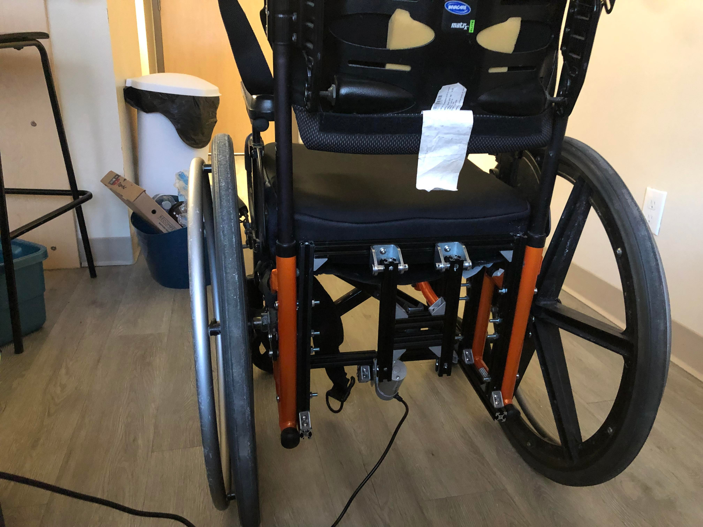

#### Electrical
The new hoverboard PCB can't be flashed with custom software, so instead we're purchasing two hoverboard motor controllers. In process of getting the motor controller to communicate with the Arduino. It's tricky getting things to work.

#### Mechanical
Machining out the t slotted aluminum. We've been steadily purchasing components and getting them shipped over. Double checking the assembly thats currently attached to the rear of the wheelchair.

